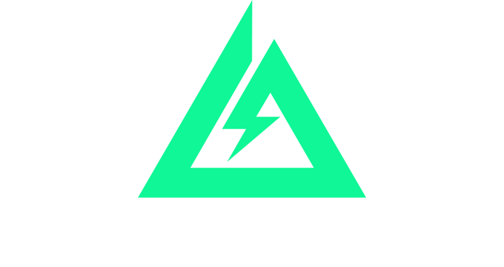

# 🎯 Delta Shuffle - Randomizador de Delta Force



## 📋 Descripción

**Delta Shuffle** es un randomizador interactivo diseñado específicamente para **Delta Force**, que permite crear experiencias únicas y desafiantes para streamers y sus comunidades. Cada partida se convierte en una aventura impredecible seleccionando aleatoriamente mapas, agentes, armas, cascos y chalecos.

## ✨ Características Principales

### 🎮 Modos de Randomización
- **🎯 Completo** - Randomiza todos los elementos simultáneamente
- **🗺️ Mapa** - Selección aleatoria de mapas disponibles
- **👤 Agente** - Elección aleatoria de personajes
- **🔫 Arma** - Randomización de armamento
- **🪖 Casco** - Selección aleatoria de protección
- **🦺 Chaleco** - Elección aleatoria de equipamiento táctico

### 💻 Tecnologías Utilizadas
- **HTML5** - Estructura semántica
- **CSS3** - Diseño responsivo con variables CSS
- **JavaScript ES6+** - Lógica de randomización y animaciones
- **Módulos ES6** - Arquitectura modular y mantenible

### 🎨 Diseño
- **Paleta militar** - Colores inspirados en temática táctica
- **Responsive Design** - Adaptable a todos los dispositivos
- **Animaciones suaves** - Efectos de rotación y transición
- **Glass Morphism** - Efectos modernos de transparencia

## 👥 Equipo de Desarrollo

### 💻 Desarrolladores
- **[Brian Jaén (JaenDev)](https://github.com/jaendev)** - Full Stack Developer
- **[Nacho Díaz (Epiiko)](https://github.com/Epiiko)** - Full Stack Developer

### 🎮 Streamers Colaboradores
- **[Campaso](https://www.twitch.tv/campasoo)** - Contenido gaming variado
- **[Hygge](https://www.twitch.tv/hyggekd)** - Gameplay estratégico
- **[Nemereth](https://www.twitch.tv/nemereth)** - Competitivo táctico

## 🚀 Instalación y Uso

### Instalación
```bash
# Clonar el repositorio
git clone https://github.com/usuario/RandomizadorDelta.git

# Navegar al directorio
cd RandomizadorDelta

# Abrir con Live Server o similar
open index.html
```

### Uso
1. **Selecciona el modo** de randomización en la navegación superior
2. **Haz clic en SHUFFLE** para iniciar la animación
3. **Espera 6 segundos** para ver el resultado final
4. **Los resultados se guardan** automáticamente en localStorage

## 📱 Características Técnicas

### 🔧 Funcionalidades
- **Persistencia local** - Guarda los últimos resultados
- **Animaciones sincronizadas** - Efectos visuales fluidos
- **Velocidades configurables** - Ajuste independiente por elemento
- **Interfaz intuitiva** - Navegación simple y clara

### 📊 Estructura del Proyecto
```
RandomizadorDelta/
├── css/
│   ├── normalize.css
│   └── style.css
├── img/
│   ├── agents/
│   ├── weapons/
│   ├── maps/
│   ├── helmets/
│   └── chest/
├── utils/
│   ├── equipament.js
│   ├── utils.js
│   └── recuperarLocalStorage.js
└── index.html
```

### 🎯 Paleta de Colores
```css
/* Militares */
--olive-green: #4a5d23
--forest-green: #2d4016
--military-tan: #8b7355
--desert-sand: #c19a6b

/* Tácticos */
--gunmetal: #2c3e50
--steel-gray: #5d6d7e
--tactical-blue: #3498db
--night-vision: #27ae60
```

## 🎮 Ideal Para

### 📺 Streamers
- **Contenido interactivo** con la audiencia
- **Partidas variadas** y entretenidas
- **Challenges personalizados** para viewers
- **Experiencias únicas** en cada stream

### 👥 Grupos de Amigos
- **Partidas casuales** con elementos aleatorios
- **Torneos divertidos** con reglas especiales
- **Desafíos entre equipos** con loadouts random
- **Sesiones de juego** más dinámicas

## 🔄 Actualizaciones Recientes

### v2.0 - Nueva Sección "About Us"
- ✅ **Tarjetas de desarrolladores** con enlaces a GitHub
- ✅ **Sección de streamers** con enlaces a Twitch
- ✅ **Diseño mejorado** con efectos modernos
- ✅ **Responsive design** optimizado
- ✅ **Nuevas animaciones** y efectos hover

### v1.5 - Mejoras de Rendimiento
- ✅ **Intervalos independientes** para mejor sincronización
- ✅ **Velocidades configurables** por elemento
- ✅ **Persistencia mejorada** en localStorage
- ✅ **Optimización de animaciones** CSS

## 📄 Licencia

Este proyecto está bajo la **Licencia MIT**. Consulta el archivo `LICENSE` para más detalles.

## 🤝 Contribuciones

Las contribuciones son bienvenidas. Para cambios importantes:

1. **Fork** el proyecto
2. **Crea** una rama para tu feature (`git checkout -b feature/AmazingFeature`)
3. **Commit** tus cambios (`git commit -m 'Add some AmazingFeature'`)
4. **Push** a la rama (`git push origin feature/AmazingFeature`)
5. **Abre** un Pull Request

## 📞 Contacto

- **Brian Jaén** - [@jaendev](https://github.com/jaendev)
- **Nacho Díaz** - [@Epiiko](https://github.com/Epiiko)

## 🎖️ Agradecimientos

- **Comunidad Delta Force** por el feedback
- **Streamers colaboradores** por las pruebas
- **Viewers** por las sugerencias de mejora

---

**© 2025 Delta Force Team. Todos los derechos reservados.**

*Llevando tus partidas de Delta Force al siguiente nivel* 🚀
